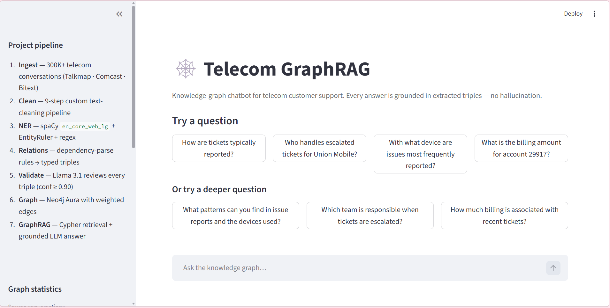
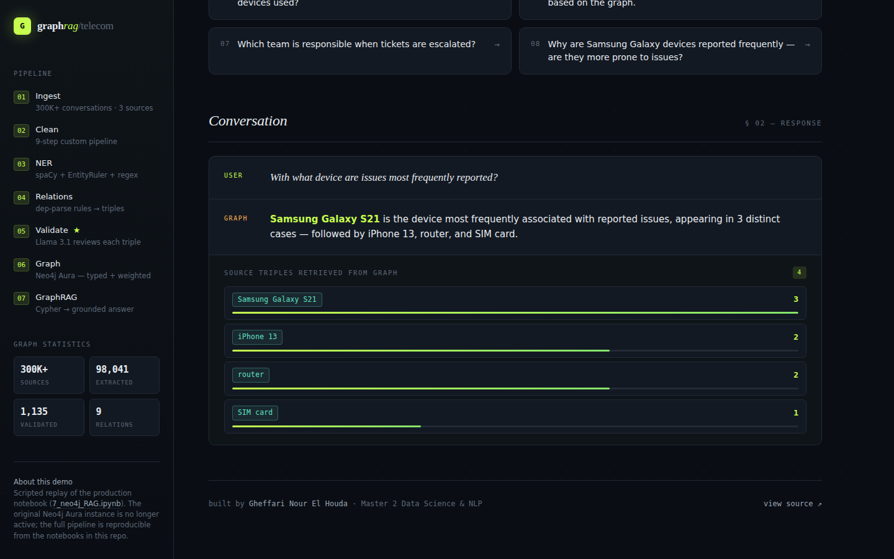
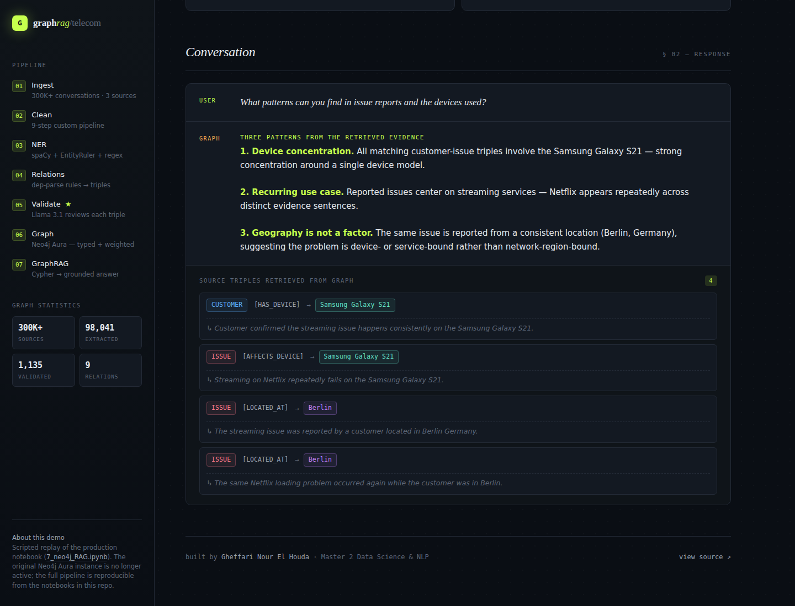
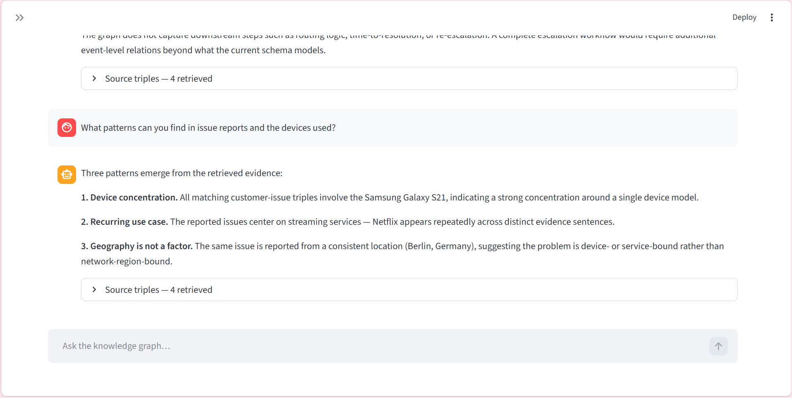

<div align="center">

# 🕸️ Telecom GraphRAG

### *Mining hidden relationships from 300K customer conversations — and asking an LLM to explain what it sees.*

[](https://python.org)
[](https://spacy.io)
[](https://neo4j.com)
[](https://langchain.com)
[](https://huggingface.co)
[](https://streamlit.io)
[](LICENSE)

<br/>

Buried inside 300,000+ raw support conversations are answers no one has time to read: *which devices fail most, which teams really handle escalations, which issues recur in which cities.*
This project pulls those hidden relationships out into a **typed knowledge graph** — then puts an **LLM on top of it as an analyst**, so you can ask the graph questions in plain English and get grounded, evidence-backed answers.
**You don't read the graph. The graph reads itself for you.**

<br/>


<sub><i>Hidden dependencies surfaced from 300K+ telecom conversations — typed entities, labeled relations, every edge validated by an LLM with confidence ≥ 0.90.</i></sub>

</div>

---

## 🎬 Live Demo

Ask the graph anything. It retrieves the relevant triples, hands them to an LLM, and the LLM gives you a synthesized answer — with the source evidence shown below so you can verify the grounding yourself.

<div align="center">
  
  <br/>
  <sub><i>Project pipeline in the sidebar; suggested questions in the main panel.</i></sub>
</div>

<br/>

<div align="center">
  
  <br/>
  <sub><i><b>Aggregation across thousands of triples</b> — the LLM surfaces which device is most associated with reported issues, with raw graph counts as verifiable evidence.</i></sub>
</div>

<br/>

<div align="center">
  
  <br/>
  <sub><i><b>Hidden pattern discovery</b> — the LLM reads the retrieved subgraph and reports back three patterns a human would have needed hours of EDA to find: device concentration, recurring use case, geographic neutrality.</i></sub>
</div>

<br/>

<div align="center">
  
  <br/>
  <sub><i><b>End-to-end process reconstruction</b> — the LLM traces an entire escalation workflow from disconnected graph fragments, and explicitly flags what the schema does not yet capture.</i></sub>
</div>

---

## 🧬 The Core Idea

Raw text is unstructured. Sales meetings, customer calls, support tickets, complaint logs — all of it sits in massive piles that nobody reads end-to-end. Inside those piles are real signals:

- *Which products keep breaking together?*
- *Which agents handle which kinds of escalations?*
- *Are issues geographic or device-specific?*
- *Which billing problems map to which service tiers?*

Traditional analytics requires you to **already know what to look for**. Vanilla RAG with embeddings can find similar passages but it cannot tell you *how things connect*. This project takes a different route:

> **Step 1 — Convert text into a graph.** Every entity (customer, device, issue, agent, account) becomes a typed node. Every relationship found in the text becomes a labeled edge with the original source sentence preserved as evidence. This turns scattered language into queryable structure.
>
> **Step 2 — Validate the graph with an LLM.** A rule-based extractor will pick up garbage. So every candidate triple is reviewed by Llama-3.1 before insertion — the LLM can fix it, normalize it, or reject it. Only triples passing `valid=True` AND `confidence ≥ 0.90` enter the final graph.
>
> **Step 3 — Use the LLM as the analyst.** When you ask a question, the system retrieves the relevant subgraph and hands it to the LLM along with strict grounding instructions. The LLM reads the graph, finds the pattern, and explains it in plain English. **You never have to look at the graph itself.**

The result is a system that **discovers relationships you didn't know were there** — and surfaces them as readable insights.

---

## ✨ Why This Project Stands Out

|                          | Most RAG projects                            | **This project**                                            |
|--------------------------|----------------------------------------------|-------------------------------------------------------------|
| Knowledge representation | Opaque embeddings                            | **Typed nodes + labeled relations**                         |
| What it surfaces         | Semantically similar passages                | **Structural relationships, dependencies, recurring patterns** |
| Provenance               | Lost after chunking                          | **Every fact traces back to a source sentence**             |
| Hallucination handling   | "Best-effort" answers                        | **Explicit *"I don't know"* when graph evidence is missing** |
| Validation               | None                                         | **LLM reviews every triple before it enters the graph**     |
| Schema                   | Ad-hoc                                       | **Formal OWL ontology — 9 classes, 14 object properties**   |
| Data sources             | Single dataset                               | **3 heterogeneous telecom datasets unified into one graph** |

The novelty isn't any single component — it's the **end-to-end discipline**: every triple is typed, validated, scored, and traceable. The LLM is constrained to act as a reader of graph evidence, not a free-form text generator.

---

## 🗺️ The Pipeline

```
┌───────────────────────────────────────────────────────────────┐
│                300K+ Telecom Conversations                    │
│       (Talkmap 200K · Comcast 5K · Bitext 27K)                │
└─────────────────────────┬─────────────────────────────────────┘
                          ▼
              ┌───────────────────────┐
              │  1. Preprocessing     │  9-step custom cleaner
              │                       │  emoji · url · noise · dedup
              └───────────┬───────────┘
                          ▼
              ┌───────────────────────┐
              │  2. NER               │  spaCy en_core_web_lg
              │                       │  + EntityRuler + regex
              │                       │  → 6 typed entities
              └───────────┬───────────┘
                          ▼
              ┌───────────────────────┐
              │  3. Relation Mining   │  dependency-parse rules
              │                       │  → (subject, relation, object)
              │                       │  with confidence scores
              └───────────┬───────────┘
                          ▼
              ┌───────────────────────┐
              │  4. LLM Validation  ★ │  Llama-3.1-8B reviewer
              │                       │  validate · fix · reject
              │                       │  → conf ≥ 0.90 gate
              └───────────┬───────────┘
                          ▼
              ┌───────────────────────┐
              │  5. Neo4j Graph       │  typed nodes + weighted
              │                       │  edges in Neo4j Aura
              └───────────┬───────────┘
                          ▼
              ┌───────────────────────┐
              │  6. GraphRAG Analyst  │  Cypher retrieval +
              │                       │  LLM reads the subgraph
              │                       │  and reports insights
              └───────────────────────┘
```

**★ The LLM-in-the-loop validation stage** is the project's novel contribution. The rule-based extractor produces ~98K candidate triples; the validator prunes them to ~1.1K high-confidence facts. **Aggressive precision was a deliberate design choice** — better a small graph the system can trust than a large graph full of noise.

---

## 🗂️ The Data

Three heterogeneous telecom datasets, unified into one coherent corpus:

| Dataset              | Records   | Type                   | Content                                  |
|----------------------|-----------|------------------------|------------------------------------------|
| **Talkmap Telecom**  | 200,000   | Multi-turn dialogues   | Customer–agent conversation transcripts  |
| **Comcast Complaints** | ~5,000  | Free-form text         | Customer complaints with category labels |
| **Bitext Customer Q&A** | 27,000 | Intent-labeled pairs   | Instruction · response · intent · category |
| **Total**            | **~300K** | **Mixed**              |                                          |

A stratified 100K sample of Talkmap was used during development; the full 200K is available for production runs.

---

## 🔬 Stage-by-Stage

### 1️⃣ Data Exploration — `2_explore_data.ipynb`

Systematic noise profiling across all three datasets revealed dataset-specific quirks that drove custom cleaning per source:

| Noise type                       | Talkmap     | Comcast    | Bitext |
|----------------------------------|-------------|------------|--------|
| URLs / links                     | ✅ frequent | rare       | rare   |
| Emojis                           | ✅ frequent | rare       | none   |
| Repeated tokens (*"to to to"*)   | ✅ frequent | rare       | none   |
| Parenthetical asides (*"(to self)"*) | ✅ frequent | none    | none   |
| Non-ASCII garbage                | ✅ frequent | occasional | rare   |

A reusable `filter_by_pattern()` utility was built for fast regex-based inspection across millions of rows.

### 2️⃣ Preprocessing — `3_preprocessing.ipynb`

Custom 9-step text cleaner built from scratch — no off-the-shelf cleaner used:

```python
clean_pipeline = [
    remove_emojis,              # Unicode emoji stripping
    remove_urls,                # http/www links
    mask_emails,                # → [EMAIL] token
    remove_mentions_hashtags,   # @user, #tag
    remove_parenthetical_noise, # "(To self)", "(Thumbs up)"
    remove_repeated_tokens,     # "to to to" → "to"
    normalize_punctuation,      # "!!!" → "!"
    remove_garbage_symbols,     # non-ASCII noise
    clean_whitespace,           # canonical spacing
]
```

All three sources unified into one clean CSV — the foundation for everything downstream.

### 3️⃣ Named Entity Recognition — `4_ner_extraction.ipynb`

The first step toward turning text into a graph: find the **entities**. Hybrid NER combines spaCy's statistical model with hand-crafted deterministic rules for telecom-specific concepts:

| Entity Type    | Examples                                          | Method                |
|----------------|---------------------------------------------------|-----------------------|
| `SERVICE`      | *data plan, broadband, roaming, voicemail*        | EntityRuler patterns  |
| `PRODUCT`      | *router, SIM card, iPhone, Android, modem*        | EntityRuler patterns  |
| `ISSUE`        | *no signal, billing issue, network outage*        | EntityRuler patterns  |
| `ACTION`       | *refund, reset, escalate, cancel, upgrade*        | EntityRuler patterns  |
| `ACCOUNT_ID`   | *AB-12345, JKL87654321*                           | Regex `[A-Z]{2,5}-?\d{4,}` |
| `PHONE_NUMBER` | *+1-800-XXX-XXXX*                                 | Regex (international) |

GPU acceleration via `thinc.prefer_gpu()` for efficient batch processing at scale.

### 4️⃣ Relation Mining — `5_relation_extraction.ipynb`

The crucial step: **finding how entities connect.** Dependency-parse-based rules walk every sentence looking for typed relationships between extracted entities. Each candidate is produced as a fully-traceable triple:

```json
{
  "subject": "customer",
  "subject_type": "PERSON",
  "relation": "REPORTED",
  "object": "billing issue",
  "object_type": "ISSUE",
  "evidence_text": "The customer reported a billing issue on their account.",
  "confidence": 0.87,
  "extraction_method": "dep_rule",
  "source": "telecom_200k"
}
```

Typed entities, relation label, source sentence, confidence score, dataset origin — every triple in the graph is fully auditable. **This is what makes the system trustable: every claim points back to a real sentence in real data.**

### 5️⃣ LLM Validation — `6_relation_cleaning.ipynb` ⭐

The novel stage. Rule-based extraction is fast but noisy. So **every candidate triple gets reviewed by Llama-3.1-8B-Instruct** via a LangChain validation chain:

```text
You are a knowledge graph validation assistant.
Your task:
- Decide if the relation is correct
- If incorrect, fix it
- If meaningless, reject it
- Normalize entity names
- Normalize relation label
Return ONLY valid JSON.
```

The LLM acts as a quality gate — catching errors the rule-based extractor cannot:
- Semantic nonsense (e.g. *"ticket REPORTED_VIA ticket"*)
- Mis-typed arguments (e.g. *VPN* labeled as a device when it's a service)
- Ambiguous references and partial entity captures

**Quality gate:** only triples where `valid=True` AND `llm_confidence ≥ 0.90` survive. The threshold is deliberately strict — the goal is a *trustable* graph, not a *large* one.

### 6️⃣ The Knowledge Graph — `7_neo4j_RAG.ipynb`

Validated triples loaded into **Neo4j Aura** with typed node labels and confidence-weighted edges:

```cypher
MERGE (a:Entity {name: $subject})
MERGE (b:Entity {name: $object})
MERGE (a)-[rel:REPORTED {confidence: $conf}]->(b)
```

Once loaded, the graph **reveals patterns that were invisible in the raw text**: which devices co-occur with which issues, which agents handle which escalations, how billing amounts cluster across accounts. The graph is also exported to NetworkX for local visualization and statistical analysis.

### 7️⃣ GraphRAG as an Analyst — `7_neo4j_RAG.ipynb`

The chatbot doesn't generate answers — it **reads the graph and reports what it finds**. Three steps:

1. **Question → Cypher** — natural language mapped to graph traversal
2. **Graph → Context** — Neo4j returns relevant `(subject)-[relation]→(object)` triples + evidence sentences
3. **Context → Insight** — the LLM is *strictly constrained* to answer from those triples

```python
prompt = f"""
You are a customer support assistant.
Answer ONLY using these facts:

{context}

Question: {question}
"""
```

The `Answer ONLY using these facts` constraint is what produces **faithful, non-hallucinated insights** — including the explicit *"I don't know"* when the graph lacks evidence. The user gets the pattern; the LLM does the reading; the graph guarantees the truth.

---

## 🧠 OWL Ontology

The graph is backed by a formal **OWL ontology** (`ontology.owl`) that defines its semantic structure:

- **Classes:** `Customer`, `Service`, `Issue`, `Device`, `Action`, `Account`, `Ticket`, `Agent`, `Team`
- **Object Properties:** `hasIssue`, `requestedAction`, `usesService`, `reportedBy`, `escalatedTo`, `memberOf`
- **Data Properties:** confidence scores, timestamps, source dataset, evidence text

The ontology ensures the graph is semantically consistent, extensible, and interoperable with other knowledge systems — and it gives the LLM a stable vocabulary to reason about.

---

## 🚀 Quick Start

### Run the demo locally

```bash
git clone https://github.com/houdhoudGH/Customer_Service_ChatBot.git
cd Customer_Service_ChatBot

python -m venv .venv
source .venv/bin/activate          # Windows: .venv\Scripts\activate

pip install -r requirements.txt
streamlit run app.py
```

The Streamlit demo runs without any external dependencies — no Neo4j credentials or LLM tokens required. It replays the question/answer pairs from the original Neo4j Aura pipeline.

### Reproduce the full pipeline

To run the full extraction and validation chain against your own data:

```bash
export NEO4J_URI="neo4j+s://your-instance.databases.neo4j.io"
export NEO4J_USERNAME="neo4j"
export NEO4J_PASSWORD="your-password"
export HUGGINGFACEHUB_API_TOKEN="hf_..."
```

Run the notebooks in order:
`1_load_data` → `2_explore_data` → `3_preprocessing` → `4_ner_extraction` → `5_relation_extraction` → `6_relation_cleaning` → `7_neo4j_RAG`

---

## ⚙️ Tech Stack

| Layer                    | Technology                                                        |
|--------------------------|-------------------------------------------------------------------|
| **NLP & NER**            | spaCy `en_core_web_lg`, EntityRuler, custom regex                 |
| **LLM Validation**       | Llama-3.1-8B-Instruct (HuggingFace Inference API)                 |
| **LLM Orchestration**    | LangChain (`LLMChain`, `SequentialChain`, `PromptTemplate`)       |
| **Graph Database**       | Neo4j Aura + `neo4j` Python driver                                |
| **Graph Analysis**       | NetworkX, Matplotlib                                              |
| **Data Processing**      | Pandas, NumPy                                                     |
| **GPU Acceleration**     | CUDA via thinc / PyTorch                                          |
| **Ontology**             | OWL / Protégé                                                     |
| **Demo UI**              | Streamlit                                                         |

---

## 📁 Repository Structure

```
Customer_Service_ChatBot/
├── app.py                                # Streamlit demo
├── ontology.owl                          # Formal OWL knowledge graph ontology
├── requirements.txt
├── data/
│   ├── raw/                              # Original datasets (git-ignored)
│   └── processed/
│       ├── all_clean_for_ner.csv
│       ├── relations_extraction.csv      # 98K extracted triples
│       └── relations_llm_validated.csv   # 1.1K LLM-validated triples
├── notebooks/
│   ├── 1_load_data.ipynb                 # Multi-source ingestion + stratified sampling
│   ├── 2_explore_data.ipynb              # EDA + noise profiling across 3 datasets
│   ├── 3_preprocessing.ipynb             # 9-step custom cleaning pipeline
│   ├── 4_ner_extraction.ipynb            # Hybrid NER (spaCy + EntityRuler + regex)
│   ├── 5_relation_extraction.ipynb       # Relation mining → typed triples
│   ├── 6_relation_cleaning.ipynb         # Dedup + Llama-3.1 LLM validation loop
│   └── 7_neo4j_RAG.ipynb                 # Graph loading + GraphRAG analyst
└── docs/
    └── images/                           # Diagrams and demo screenshots
```

---

## 🔮 Roadmap

The pipeline is production-ready for static knowledge graphs. Five directions for extension:

- **Domain-adapted NER** — fine-tune spaCy on annotated telecom data for higher entity recall
- **Temporal reasoning** — extend the ontology with time-indexed relations (e.g. *issue resolved on date*) to enable trend analysis
- **Community detection** — Louvain clustering to surface natural issue groups and hidden subnetworks the LLM can summarize
- **Graph embeddings** — Node2Vec embeddings for similarity-based retrieval, enabling *"find tickets like this one"* queries
- **Retrieval benchmarking** — head-to-head comparison of GraphRAG vs. vanilla vector RAG on a held-out Q&A evaluation set

---

## 📄 License

MIT — see [LICENSE](LICENSE) for details.

---

<div align="center">

### Built by **Gheffari Nour El Houda**

<sub>Master 2 Data Science & NLP · AI Engineer</sub>

<br/>

<sub><i>This project explores knowledge graphs, LLM-in-the-loop validation, and faithful RAG —<br/>
demonstrating how structured extraction can surface hidden patterns from unstructured text,<br/>
and how an LLM can act as an analyst that</i> <strong>reads the graph so you don't have to.</strong></sub>

<br/>
<br/>

<sub>spaCy · Neo4j · LangChain · HuggingFace · Llama 3.1 · NetworkX · Streamlit · OWL</sub>

<br/>
<br/>

<sub>⭐ <i>If you found this useful, consider giving the repo a star</i></sub>

</div>
