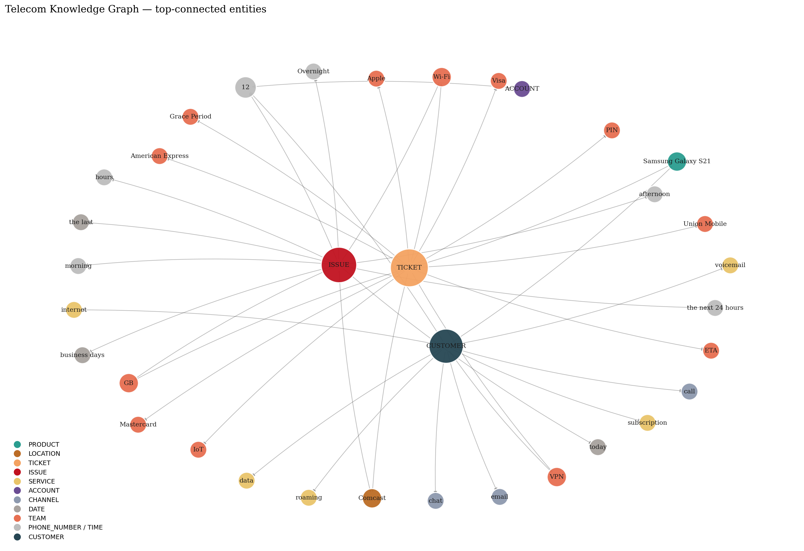

<div align="center">

# 🕸️ Telecom GraphRAG

### *A faithful knowledge-graph chatbot for telecom customer support*

From **300,000+ raw conversations** → typed entities → LLM-validated triples → Neo4j knowledge graph → grounded chatbot answers.

[](https://python.org)
[](https://spacy.io)
[](https://neo4j.com)
[](https://langchain.com)
[](https://huggingface.co)
[](https://streamlit.io)
[](LICENSE)

<br/>



<sub><i>Knowledge graph extracted from 300K+ telecom support conversations.<br/>
Each node is a typed entity; each edge is an LLM-validated relation with confidence ≥ 0.90.</i></sub>

</div>

---

## ✨ Why This Project Stands Out

Most chatbot projects fine-tune an LLM on FAQ pairs and call it a day. This one does something genuinely different — it builds a **structured semantic graph** from raw conversations, then uses that graph as the only source of truth the chatbot is allowed to consult.

| | Most RAG projects | **This project** |
|---|---|---|
| Knowledge representation | Opaque embeddings | **Typed nodes + labeled relations** |
| Provenance | Lost after chunking | **Every fact traces to a source sentence** |
| Hallucination handling | "Best-effort" answers | **Explicit *"I don't know"* when evidence is missing** |
| Validation | None | **LLM-in-the-loop reviews every triple before insertion** |
| Schema | Ad-hoc | **Formal OWL ontology** |
| Data sources | Single dataset | **3 heterogeneous telecom datasets unified** |

The novelty isn't any single component — it's the **end-to-end discipline**: every triple is typed, validated, scored, and traceable to the sentence it came from.

---

## 🎬 Live Demo

A local Streamlit app loads the validated triples and lets you query the graph through a chat interface. Source triples are shown below each answer so you can verify the grounding yourself.

<div align="center">
  
  <br/>
  <sub><i>Project pipeline in the sidebar; suggested questions in the main panel.</i></sub>
</div>

<br/>

<div align="center">
  
  <br/>
  <sub><i><b>Aggregation</b> — the system counts device co-occurrences across the graph and returns the most frequent, with raw counts visible as source evidence.</i></sub>
</div>

<br/>

<div align="center">
  
  <br/>
  <sub><i><b>Analytical reasoning</b> — the system synthesizes patterns across multiple retrieved triples (device concentration, recurring use case, geography).</i></sub>
</div>

<br/>

<div align="center">
  
  <br/>
  <sub><i><b>Long-form reasoning</b> — multi-step process explained from graph evidence, with explicit acknowledgement of what the schema does not capture.</i></sub>
</div>

> ⭐ **Faithful uncertainty by design.** When the graph lacks the evidence to answer a question, the chatbot says *"I don't know"* and lists the facts it actually has — instead of confidently hallucinating. This is the single most important property of the system.

---

## 🗺️ The Pipeline

Six stages, each fully reproducible from the notebooks in this repo.

```
┌───────────────────────────────────────────────────────────────┐
│                300K+ Telecom Conversations                    │
│       (Talkmap 200K · Comcast 5K · Bitext 27K)                │
└─────────────────────────┬─────────────────────────────────────┘
                          ▼
              ┌───────────────────────┐
              │  1. Preprocessing     │  9-step custom cleaner
              │                       │  emoji · url · noise · dedup
              └───────────┬───────────┘
                          ▼
              ┌───────────────────────┐
              │  2. NER               │  spaCy en_core_web_lg
              │                       │  + EntityRuler + regex
              │                       │  → 6 typed entities
              └───────────┬───────────┘
                          ▼
              ┌───────────────────────┐
              │  3. Relations         │  dependency-parse rules
              │                       │  → (s, r, o) + confidence
              └───────────┬───────────┘
                          ▼
              ┌───────────────────────┐
              │  4. LLM Validation  ★ │  Llama-3.1-8B reviewer
              │                       │  validate · fix · reject
              │                       │  → conf ≥ 0.90 gate
              └───────────┬───────────┘
                          ▼
              ┌───────────────────────┐
              │  5. Neo4j Graph       │  typed nodes + weighted
              │                       │  edges in Neo4j Aura
              └───────────┬───────────┘
                          ▼
              ┌───────────────────────┐
              │  6. GraphRAG Chat     │  Cypher retrieval +
              │                       │  grounded LLM answer
              └───────────────────────┘
```

**★ The LLM-in-the-loop validation stage** is the project's novel contribution — every extracted triple is reviewed by Llama-3.1 before insertion. The validator can fix, normalize, or reject triples, and only those passing a strict 0.90 confidence gate make it into the final graph.

---

## 🗂️ The Data

Three heterogeneous telecom datasets unified into one coherent corpus:

| Dataset | Records | Type | Content |
|---|---|---|---|
| **Talkmap Telecom** | 200,000 | Multi-turn dialogues | Customer-agent conversation transcripts |
| **Comcast Complaints** | ~5,000 | Free-form text | Customer complaints with category labels |
| **Bitext Customer Q&A** | 27,000 | Intent-labeled pairs | Instruction · response · intent · category |
| **Total** | **~300K** | **Mixed** | |

A stratified 100K sample of Talkmap was used during development; the full 200K is available for production runs.

---

## 🔬 Stage-by-Stage

### 1️⃣ Data Exploration — `2_explore_data.ipynb`

Systematic noise profiling across all three datasets revealed dataset-specific quirks that drove custom cleaning per source:

| Noise type | Talkmap | Comcast | Bitext |
|---|---|---|---|
| URLs / links | ✅ frequent | rare | rare |
| Emojis | ✅ frequent | rare | none |
| Repeated tokens (*"to to to"*) | ✅ frequent | rare | none |
| Parenthetical asides (*"(to self)"*) | ✅ frequent | none | none |
| Non-ASCII garbage | ✅ frequent | occasional | rare |

A reusable `filter_by_pattern()` utility was built for fast regex-based inspection across millions of rows.

### 2️⃣ Preprocessing — `3_preprocessing.ipynb`

Custom 9-step text cleaner built from scratch — no off-the-shelf cleaner used:

```python
clean_pipeline = [
    remove_emojis,              # Unicode emoji stripping
    remove_urls,                # http/www links
    mask_emails,                # → [EMAIL] token
    remove_mentions_hashtags,   # @user, #tag
    remove_parenthetical_noise, # "(To self)", "(Thumbs up)"
    remove_repeated_tokens,     # "to to to" → "to"
    normalize_punctuation,      # "!!!" → "!"
    remove_garbage_symbols,     # non-ASCII noise
    clean_whitespace,           # canonical spacing
]
```

All three sources unified into one clean CSV.

### 3️⃣ Named Entity Recognition — `4_ner_extraction.ipynb`

Hybrid NER combining spaCy's statistical model with hand-crafted deterministic rules:

| Entity Type | Examples | Method |
|---|---|---|
| `SERVICE` | *data plan, broadband, roaming, voicemail* | EntityRuler patterns |
| `PRODUCT` | *router, SIM card, iPhone, Android, modem* | EntityRuler patterns |
| `ISSUE` | *no signal, billing issue, network outage* | EntityRuler patterns |
| `ACTION` | *refund, reset, escalate, cancel, upgrade* | EntityRuler patterns |
| `ACCOUNT_ID` | *AB-12345, JKL87654321* | Regex `[A-Z]{2,5}-?\d{4,}` |
| `PHONE_NUMBER` | *+1-800-XXX-XXXX* | Regex (international formats) |

GPU acceleration via `thinc.prefer_gpu()` for efficient batch processing.

### 4️⃣ Relation Extraction — `5_relation_extraction.ipynb`

Dependency-parse rules extract structured, fully-traceable triples:

```json
{
  "subject": "customer",
  "subject_type": "PERSON",
  "relation": "REPORTED",
  "object": "billing issue",
  "object_type": "ISSUE",
  "evidence_text": "The customer reported a billing issue on their account.",
  "confidence": 0.87,
  "extraction_method": "dep_rule",
  "source": "telecom_200k"
}
```

Typed entities, relation label, source sentence, confidence score, dataset origin — every triple is fully auditable.

### 5️⃣ LLM Validation — `6_relation_cleaning.ipynb` ⭐

The novel stage. Every triple gets reviewed by Llama-3.1-8B-Instruct via LangChain:

```text
You are a knowledge graph validation assistant.
Your task:
- Decide if the relation is correct
- If incorrect, fix it
- If meaningless, reject it
- Normalize entity names
- Normalize relation label
Return ONLY valid JSON.
```

**Quality gate:** only triples where `valid=True` AND `confidence ≥ 0.90` survive. The validator catches errors that the rule-based extractor cannot — semantic nonsense, mis-typed arguments, and ambiguous references.

### 6️⃣ Neo4j Knowledge Graph — `7_neo4j_RAG.ipynb`

Validated triples loaded into **Neo4j Aura** with typed nodes and weighted edges:

```cypher
MERGE (a:Entity {name: $subject})
MERGE (b:Entity {name: $object})
MERGE (a)-[rel:REPORTED {confidence: $conf}]->(b)
```

Graph also exported to NetworkX for local statistical analysis and visualization.

### 7️⃣ GraphRAG Chatbot — `7_neo4j_RAG.ipynb`

A three-step retrieval-augmented generation chain:

1. **Question → Cypher** — natural language mapped to graph traversal
2. **Graph → Context** — Neo4j returns relevant `(subject)-[relation]→(object)` triples
3. **Context → Answer** — LLM generates a response grounded *strictly* in graph evidence

```python
prompt = f"""
You are a customer support assistant.
Answer ONLY using these facts:

{context}

Question: {question}
"""
```

The `Answer ONLY using these facts` constraint is what produces faithful, non-hallucinated responses — including the explicit *"I don't know"* when the graph lacks evidence.

---

## 🧠 OWL Ontology

The graph is backed by a formal **OWL ontology** (`ontology.owl`) that defines its semantic structure:

- **Classes:** `Customer`, `Service`, `Issue`, `Device`, `Action`, `Account`, `Ticket`, `Agent`, `Team`
- **Object Properties:** `hasIssue`, `requestedAction`, `usesService`, `reportedBy`, `escalatedTo`, `memberOf`
- **Data Properties:** confidence scores, timestamps, source dataset, evidence text

The ontology ensures the graph is semantically consistent, extensible, and interoperable with other knowledge systems.

---

## 🚀 Quick Start

### Run the demo locally

```bash
git clone https://github.com/houdhoudGH/Customer_Service_ChatBot.git
cd Customer_Service_ChatBot

python -m venv .venv
source .venv/bin/activate          # Windows: .venv\Scripts\activate

pip install -r requirements.txt
streamlit run app.py
```

The Streamlit demo runs without any external dependencies — no Neo4j credentials or LLM tokens required. It replays the question/answer pairs from the original Neo4j Aura pipeline.

### Reproduce the full pipeline

To run the full extraction and validation chain against your own data:

```bash
export NEO4J_URI="neo4j+s://your-instance.databases.neo4j.io"
export NEO4J_USERNAME="neo4j"
export NEO4J_PASSWORD="your-password"
export HUGGINGFACEHUB_API_TOKEN="hf_..."
```

Run the notebooks in order:
`1_load_data` → `2_explore_data` → `3_preprocessing` → `4_ner_extraction` → `5_relation_extraction` → `6_relation_cleaning` → `7_neo4j_RAG`

---

## ⚙️ Tech Stack

| Layer | Technology |
|---|---|
| **NLP & NER** | spaCy `en_core_web_lg`, EntityRuler, custom regex |
| **LLM Validation** | Llama-3.1-8B-Instruct (HuggingFace Inference API) |
| **LLM Orchestration** | LangChain (`LLMChain`, `SequentialChain`, `PromptTemplate`) |
| **Graph Database** | Neo4j Aura + `neo4j` Python driver |
| **Graph Analysis** | NetworkX, Matplotlib |
| **Data Processing** | Pandas, NumPy |
| **GPU Acceleration** | CUDA via thinc / PyTorch |
| **Ontology** | OWL / Protégé |
| **Demo UI** | Streamlit |

---

## 📁 Repository Structure

```
Customer_Service_ChatBot/
├── app.py                                # Streamlit demo
├── ontology.owl                          # Formal OWL knowledge graph ontology
├── requirements.txt
├── data/
│   ├── raw/                              # Original datasets (git-ignored)
│   └── processed/
│       ├── all_clean_for_ner.csv
│       ├── relations_extraction.csv      # 98K extracted triples
│       └── relations_llm_validated.csv   # 1.1K LLM-validated triples
├── notebooks/
│   ├── 1_load_data.ipynb                 # Multi-source ingestion + stratified sampling
│   ├── 2_explore_data.ipynb              # EDA + noise profiling across 3 datasets
│   ├── 3_preprocessing.ipynb             # 9-step custom cleaning pipeline
│   ├── 4_ner_extraction.ipynb            # Hybrid NER (spaCy + EntityRuler + regex)
│   ├── 5_relation_extraction.ipynb       # Triple extraction with typed confidence scores
│   ├── 6_relation_cleaning.ipynb         # Dedup + Llama-3.1 LLM validation loop
│   └── 7_neo4j_RAG.ipynb                 # Graph loading + GraphRAG chatbot
└── docs/
    └── images/                           # Diagrams and demo screenshots
```

---

## 🔮 Roadmap

The pipeline is production-ready for static knowledge graphs. Five directions for extension:

- **Domain-adapted NER** — fine-tune spaCy on annotated telecom data for higher entity recall
- **Temporal reasoning** — extend the ontology with time-indexed relations (e.g. *issue resolved on date*)
- **Retrieval benchmarking** — head-to-head GraphRAG vs vanilla vector RAG on a held-out Q&A evaluation set
- **Graph intelligence** — community detection (Louvain) to surface issue clusters, plus Node2Vec embeddings for similarity-based retrieval
- **Confidence calibration** — analyze the precision/recall tradeoff of the LLM-validation threshold across multiple operating points

---

## 📄 License

MIT — see [LICENSE](LICENSE) for details.

---

<div align="center">

### Built by **Gheffari Nour El Houda**

<sub>Master 2 Data Science & NLP · AI Engineer</sub>

<br/>

<sub><i>This project explores knowledge graphs, LLM-in-the-loop validation, and faithful RAG —<br/>
demonstrating how structured extraction can produce chatbots that</i> <strong>know what they don't know.</strong></sub>

<br/>
<br/>

<sub>spaCy · Neo4j · LangChain · HuggingFace · Llama 3.1 · NetworkX · Streamlit · OWL</sub>

<br/>
<br/>

<sub>⭐ <i>If you found this useful, consider giving the repo a star</i></sub>

</div>
