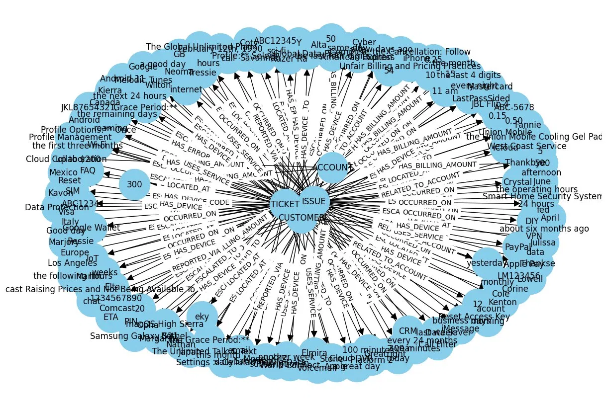
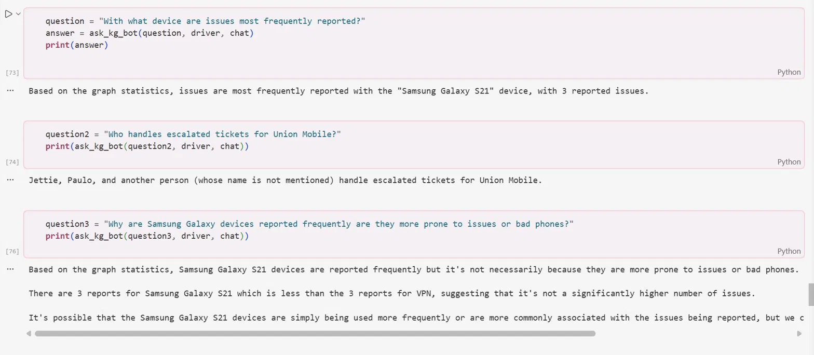
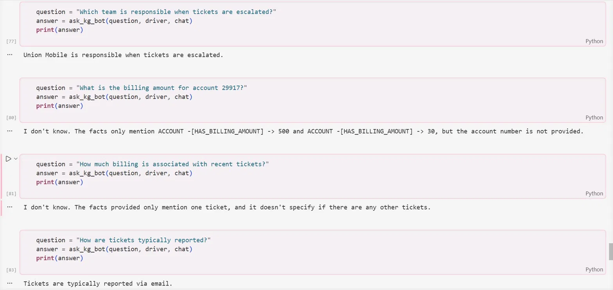
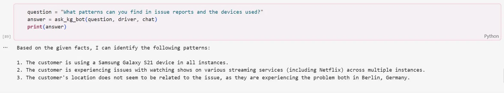

<div align="center">

<h1>🕸️ Telecom GraphRAG</h1>

<p><strong>End-to-End Knowledge Graph Pipeline for Telecom Customer Support Intelligence</strong></p>

[](https://python.org)
[](https://spacy.io)
[](https://neo4j.com)
[](https://langchain.com)
[](https://huggingface.co)
[](LICENSE)

<br/>

<p>
From <strong>300,000+ raw telecom conversations</strong> to a knowledge graph-powered chatbot —<br/>
a full NLP pipeline: cleaning → NER → relation extraction → LLM validation → Neo4j → GraphRAG.
</p>

</div>

---

## 🌟 What Makes This Project Different

Most chatbot projects stop at fine-tuning a model on FAQ pairs. This one goes further:

- **Structured knowledge extraction** — not just embeddings, but typed entities and labeled relations
- **LLM-in-the-loop validation** — Llama 3.1 reviews every extracted triple before it enters the graph
- **Faithful uncertainty** — the bot says *"I don't know"* when graph evidence is missing, instead of hallucinating
- **Formal OWL ontology** — the knowledge graph has a semantic schema, not just ad-hoc nodes
- **3-source data fusion** — three heterogeneous telecom datasets unified into one coherent graph

---

## 🗺️ Pipeline at a Glance

```
┌─────────────────────────────────────────────────────────────────┐
│                   300K+ Telecom Conversations                   │
│         (Talkmap 200K · Comcast Complaints · Bitext 27K)        │
└─────────────────────────┬───────────────────────────────────────┘
                          │
                          ▼
              ┌───────────────────────┐
              │   1. Preprocessing    │  Emoji removal, URL masking,
              │                       │  noise cleaning, deduplication,
              │                       │  repeated token collapse
              └───────────┬───────────┘
                          │
                          ▼
              ┌───────────────────────┐
              │  2. NER Extraction    │  spaCy en_core_web_lg +
              │                       │  custom EntityRuler patterns +
              │                       │  regex (ACCOUNT_ID, PHONE)
              │                       │  → 6 entity types
              └───────────┬───────────┘
                          │
                          ▼
              ┌───────────────────────┐
              │ 3. Relation Extraction│  Dependency-based rules
              │                       │  → (subject, relation, object)
              │                       │  triples with confidence scores
              └───────────┬───────────┘
                          │
                          ▼
              ┌───────────────────────┐
              │  4. LLM Validation    │  Llama-3.1-8B-Instruct
              │                       │  validates, fixes, normalizes,
              │                       │  and rejects bad triples
              └───────────┬───────────┘
                          │
                          ▼
              ┌───────────────────────┐
              │   5. Neo4j Graph      │  Typed nodes + weighted edges
              │                       │  loaded into Neo4j Aura cloud
              │                       │  → queryable knowledge graph
              └───────────┬───────────┘
                          │
                          ▼
              ┌───────────────────────┐
              │   6. GraphRAG Chat    │  LangChain chain queries graph
              │                       │  → injects facts into prompt
              │                       │  → LLM generates grounded answer
              └───────────────────────┘
```

---

## 📊 The Knowledge Graph

After processing, all validated relations are loaded into Neo4j and visualized as a directed graph. Central hubs — **CUSTOMER**, **TICKET**, **ISSUE**, **ACCOUNT** — connect hundreds of real-world entities extracted from telecom support conversations.

<!-- drag and drop your graph screenshot here -->
<div align="center">
  
  <br/>
  <sub><i>Knowledge graph built from 300K+ telecom conversations. Nodes = typed entities, edges = LLM-validated relations.</i></sub>
</div>

---

## 🗂️ Datasets

| Dataset | Records | Type | Key Fields |
|---|---|---|---|
| Talkmap Telecom | 200,000 | Multi-turn dialogues | conversation text, timestamps |
| Comcast Complaints | ~5,000 | Customer complaints | complaint text, categories |
| Bitext Customer Q&A | 27,000 | Intent-labeled responses | instruction, response, intent, category |
| **Total** | **~300K** | **Mixed** | |

A stratified 100K sample of Talkmap was used for development; the full 200K is available for production runs.

---

## 🔬 Stage-by-Stage Breakdown

### Stage 1 — Data Exploration (`2_explore_data.ipynb`)

Systematic noise profiling across all three datasets before any processing:

- Detected and quantified: URLs, emails, emojis, repeated punctuation, hashtags, @mentions
- Revealed dataset-specific quirks that drove custom cleaning rules per source
- Built reusable `filter_by_pattern()` utility for quick pattern-based inspection

### Stage 2 — Preprocessing (`3_preprocessing.ipynb`)

A custom multi-step text cleaning pipeline built from scratch — no off-the-shelf cleaner used:

```python
clean_pipeline = [
    remove_emojis,              # Strip unicode emoji characters
    remove_urls,                # Remove http/www links
    mask_emails,                # Replace emails with [EMAIL] token
    remove_mentions_hashtags,   # Strip @user and #tag
    remove_parenthetical_noise, # Remove "(To self)", "(Thumbs up)" etc.
    remove_repeated_tokens,     # Collapse "to to to" → "to"
    normalize_punctuation,      # "!!!" → "!"
    remove_garbage_symbols,     # Non-ASCII noise
    clean_whitespace            # Normalize spaces and newlines
]
```

All three sources unified into one clean CSV for all downstream stages.

### Stage 3 — Named Entity Recognition (`4_ner_extraction.ipynb`)

Hybrid NER combining spaCy's statistical model with hand-crafted deterministic rules:

| Entity Type | Examples | Method |
|---|---|---|
| `SERVICE` | *data plan, broadband, roaming, voicemail* | EntityRuler patterns |
| `PRODUCT` | *router, SIM card, iPhone, Android, modem* | EntityRuler patterns |
| `ISSUE` | *no signal, billing issue, network outage, dropped calls* | EntityRuler patterns |
| `ACTION` | *refund, reset, escalate, cancel, upgrade* | EntityRuler patterns |
| `ACCOUNT_ID` | *AB-12345, JKL87654321* | Regex `[A-Z]{2,5}-?\d{4,}` |
| `PHONE_NUMBER` | *+1-800-XXX-XXXX* | Regex (international formats) |

GPU acceleration via `thinc.prefer_gpu()` for efficient batch processing at scale.

### Stage 4 — Relation Extraction (`5_relation_extraction.ipynb`)

Dependency-parse-based rules extract structured triples from every sentence:

```json
{
  "subject": "customer",
  "subject_type": "PERSON",
  "relation": "REPORTED",
  "object": "billing issue",
  "object_type": "ISSUE",
  "evidence_text": "The customer reported a billing issue on their account.",
  "confidence": 0.87,
  "extraction_method": "dep_rule",
  "source": "telecom_200k"
}
```

Every triple is fully traceable: typed entities, relation label, source sentence, confidence score, and dataset origin.

### Stage 5 — LLM Validation (`6_relation_cleaning.ipynb`)

The most novel stage — an **LLM-in-the-loop cleaning pipeline** using Llama-3.1-8B-Instruct:

**Step 1 — Deduplication:** triples deduplicated by `(subject, relation, object)`, keeping the highest-confidence instance.

**Step 2 — LLM review via LangChain:** each triple is passed to Llama with a structured prompt:

```
You are a knowledge graph validation assistant.
Your task:
- Decide if the relation is correct
- If incorrect, fix it
- If meaningless, reject it
- Normalize entity names
- Normalize relation label
Return ONLY valid JSON.
```

**Step 3 — Quality gate:** only triples where `valid=True` AND `confidence ≥ 0.90` enter the final graph.

Built with LangChain `LLMChain` + `SequentialChain` + `PromptTemplate`.

### Stage 6 — Neo4j Knowledge Graph (`7_neo4j_RAG.ipynb`)

Validated triples loaded into **Neo4j Aura** with typed node labels and relationship weights:

```cypher
MERGE (a:Entity {name: $subject})
MERGE (b:Entity {name: $object})
MERGE (a)-[rel:REPORTED {confidence: $conf}]->(b)
```

Graph exported to NetworkX for local visualization and statistical analysis.

### Stage 7 — GraphRAG Chatbot

A three-step retrieval-augmented generation chain:

1. **Question → Cypher query** — natural language mapped to graph traversal
2. **Graph → Context** — Neo4j returns relevant `(subject)-[relation]->(object)` triples as facts
3. **Context → Answer** — LLM generates a response grounded strictly in graph evidence

```python
prompt = f"""
You are a customer support assistant.
Answer ONLY using these facts:

{context}

Question: {question}
"""
```

The `Answer ONLY using these facts` constraint is what produces faithful, non-hallucinated responses.

---

## 💬 GraphRAG in Action

The chatbot answers questions by querying the knowledge graph and grounding every response in real extracted facts — no hallucination, no guessing.

<!-- drag and drop your Q&A screenshots here -->
<div align="center">
  
  
</div>
<div align="center" style="margin-top:8px">
  
</div>

<br/>

| Question | Answer |
|---|---|
| *"With what device are issues most frequently reported?"* | Samsung Galaxy S21 (3 reports) |
| *"Who handles escalated tickets for Union Mobile?"* | Jettie, Paulo, and one unnamed agent |
| *"Which team is responsible when tickets are escalated?"* | Union Mobile |
| *"How are tickets typically reported?"* | Via email |
| *"What patterns exist in issue reports and devices used?"* | Samsung Galaxy S21 in all instances; Netflix streaming issues recur across locations |

> **Faithful uncertainty in action:** when the graph lacks sufficient evidence, the bot explicitly responds *"I don't know. The facts only mention ACCOUNT -[HAS_BILLING_AMOUNT]→ 500..."* — this is a deliberate design choice. A system that admits uncertainty is more reliable in production than one that confidently hallucinates.

---

## 🧠 Knowledge Graph Ontology

The project includes a formal **OWL ontology** (`ontology.owl`) that defines the semantic structure of the graph:

- **Classes**: `Customer`, `Service`, `Issue`, `Device`, `Action`, `Account`, `Ticket`
- **Object Properties**: `hasIssue`, `requestedAction`, `usesService`, `reportedBy`, `escalatedTo`
- **Data Properties**: confidence scores, timestamps, source dataset labels

This ensures the graph is semantically consistent, extensible, and compatible with other knowledge systems — a level of rigor rarely seen in student or research projects.

---

## 📁 Repository Structure

```
telecom-graphrag/
├── data/
│   ├── raw/                         # Original datasets (git-ignored)
│   └── processed/
│       ├── all_clean_for_ner.csv
│       ├── relations_extraction.csv
│       └── relations_llm_validated.csv
├── notebooks/
│   ├── 1_load_data.ipynb            # Multi-source ingestion + stratified sampling
│   ├── 2_explore_data.ipynb         # EDA + noise profiling across 3 datasets
│   ├── 3_preprocessing.ipynb        # 9-step custom cleaning pipeline
│   ├── 4_ner_extraction.ipynb       # Hybrid NER (spaCy + EntityRuler + regex)
│   ├── 5_relation_extraction.ipynb  # Triple extraction with typed confidence scores
│   ├── 6_relation_cleaning.ipynb    # Dedup + Llama-3.1 LLM validation loop
│   ├── 7_neo4j_RAG.ipynb            # Graph loading + GraphRAG chatbot v1
│   └── 8_neo4j_RAG.ipynb            # GraphRAG chatbot v2 (improved querying)
├── docs/
│   └── images/                      # Screenshots used in this README
├── ontology.owl                     # Formal OWL knowledge graph ontology
└── requirements.txt
```

---

## ⚙️ Tech Stack

| Layer | Technology |
|---|---|
| **NLP & NER** | spaCy `en_core_web_lg`, EntityRuler, custom regex |
| **LLM Validation** | Llama-3.1-8B-Instruct via HuggingFace Inference API |
| **LLM Orchestration** | LangChain (`LLMChain`, `SequentialChain`, `PromptTemplate`) |
| **Graph Database** | Neo4j Aura (cloud) + `neo4j` Python driver |
| **Graph Analysis** | NetworkX, Matplotlib |
| **Data Processing** | Pandas, NumPy |
| **GPU Acceleration** | CUDA via thinc / PyTorch |
| **Ontology** | OWL / Protégé |
| **Visualization** | Vis.js, Tom-Select |

---

## 🚀 Getting Started

```bash
git clone https://github.com/houdhoudGH/telecom-graphrag.git
cd telecom-graphrag

python -m venv .venv
source .venv/bin/activate        # Windows: .venv\Scripts\activate

pip install -r requirements.txt
```

Set environment variables before running the notebooks:

```bash
export NEO4J_URI="neo4j+s://your-instance.databases.neo4j.io"
export NEO4J_USERNAME="neo4j"
export NEO4J_PASSWORD="your-password"
export HUGGINGFACEHUB_API_TOKEN="your-hf-token"
```

Run notebooks in order:
`1_load_data` → `2_explore_data` → `3_preprocessing` → `4_ner_extraction` → `5_relation_extraction` → `6_relation_cleaning` → `7_neo4j_RAG`

---

## 🔮 Future Work

- [ ] Fine-tune NER on domain-annotated telecom data for higher entity recall
- [ ] Add community detection (Louvain algorithm) to surface issue clusters
- [ ] Build a Streamlit or Gradio interactive demo
- [ ] Benchmark GraphRAG vs vanilla vector RAG on a held-out Q&A evaluation set
- [ ] Extend ontology with temporal relations (e.g. *issue resolved on date*)
- [ ] Add graph embeddings (Node2Vec) for similarity-based retrieval

---

## 📄 License

MIT — see [LICENSE](LICENSE) for details.

---

<div align="center">

**Built by [Houda](https://github.com/houdhoudGH)**
*· Master 2 Data Science & NLP · AI Engineer ·*

<br/>
<sub>spaCy · Neo4j · LangChain · HuggingFace · Llama 3.1 · NetworkX · OWL</sub>

</div>
